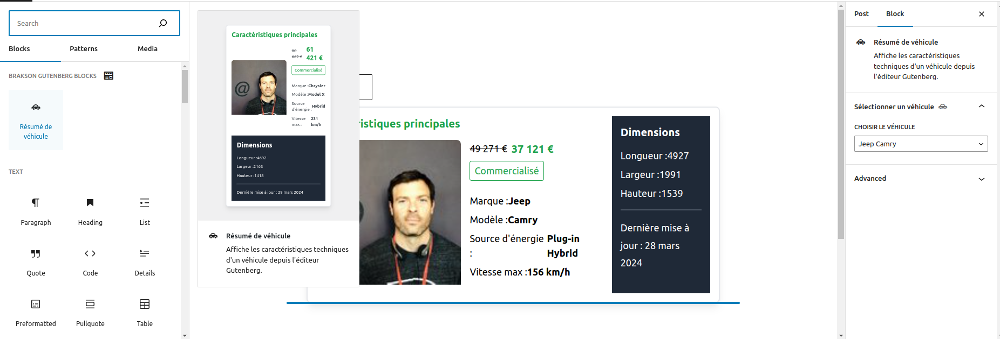

### === Vehicle Summary Gutenberg Block ===

**Contributors:** Aziguy, F7b5
**Tags:** block, Gutenberg, vehicle  
**Tested up to:** 6.4.3  
**Stable tag:** 0.1.0  
**License:** GPL-2.0-or-later  
**License URI:** [https://www.gnu.org/licenses/gpl-2.0.html](https://www.gnu.org/licenses/gpl-2.0.html)

This WordPress plugin enables the display of technical specifications for vehicles directly within the Gutenberg editor. Leveraging an external database, it seamlessly retrieves and showcases this information.

## === Features ===

- Display vehicle technical specifications within the Gutenberg editor.
- Integration of a new Gutenberg block named "Vehicle Summary".
- Customization options for block appearance and displayed information.
- Addition of a new Gutenberg block category named "Brakson Gutenberg blocks".

## === Requirements ===

- WordPress version 6.4.3 or later.
- PHP version 7.0 or later.

## === Installation ===

1. Download the plugin from [the plugin's URL on the Brakson website](https://brakson.com/).
2. Upload the ZIP file to your WordPress installation.
3. Activate the plugin through the WordPress "Plugins" page.

## === Usage ===

Once activated, you can utilize the "Vehicle Summary" block within the Gutenberg editor. Customize the displayed information according to the external database utilized.

## === Tailwind Configuration ===

This project utilizes Tailwind CSS for style management. To compile CSS files, execute the following command:

```bash
npm run build
```

This command compiles the `tailwind.css` file located in the `src/assets/css` directory into a `style.css` file within the `build` directory.

## === npm Dependencies ===

This project uses npm for dependency management. Below are the project's devDependencies:

- `@wordpress/scripts`: WordPress script collection for development.
- `autoprefixer`: PostCSS tool for automatically adding CSS browser prefixes.
- `postcss`: CSS post-processing tool.
- `tailwindcss`: Utility-first CSS framework.

And here are the project's dependencies:

- `@wordpress/block-editor`: WordPress block editor module.
- `@wordpress/blocks`: API for registering and managing WordPress blocks.
- `@wordpress/components`: WordPress UI components.
- `@wordpress/compose`: Library for creating functional React components in WordPress.
- `@wordpress/data`: Data management in WordPress applications.
- `@wordpress/element`: API for creating React elements in WordPress.
- `axios`: Promise-based HTTP client for browsers and node.js.

## === Support ===

If you encounter any issues or have questions regarding the usage of this plugin, please [contact us](https://www.saabre.com/).

## === Contributions ===

Contributions are welcome! If you'd like to contribute to the improvement of this plugin, please submit a pull request on [GitHub](https://github.com/Aziguy/resume-de-vehicule).

## === Development Setup ===

To continue development on this Gutenberg block, follow these steps:

1. Clone the repository from [GitHub](https://github.com/Aziguy/resume-de-vehicule).
2. Navigate to the project directory in your terminal.
3. Run `npm install` to install the project dependencies.
4. Use `npm start` to start the development .
5. Make changes to the block code as needed. The block files are located in the `src` directory.
6. After making changes, use `npm run build` to compile the CSS and JavaScript files. This will update the `build` directory with the latest changes.
7. Test your changes within the WordPress editor to ensure everything works as expected.
8. Commit your changes and push them.
9. If you would like to contribute your changes to the main repository, submit a pull request on GitHub.

By following these steps, you can easily continue development on this Gutenberg block and contribute improvements to our amazing ( ͡° ͜ʖ ͡° )resume-vehicule block.

## === Future Improvements ===

While the current version of the Vehicle Summary Gutenberg block provides essential functionality, there are several areas for potential improvement and enhancement:

1. **Automated Testing with GitHub Actions:** Implement automated end-to-end (E2E) tests using the `@wordpress/e2e-test-utils` package and GitHub Actions.

2. **Customization Options for Administrators:** Allow administrators (journalists) to customize the appearance of the block by providing options for changing colors, typography, and other styling attributes. This can be achieved through additional block setting attributes.o

3. **Enhanced Vehicle Selection:** Instead of using a dropdown selector, provide a more user-friendly interface for selecting vehicles. For example, implement a search field where users can enter the name or model of the vehicle they want to display. This will improve the user experience and make it easier to find specific vehicles, especially in cases where the list of vehicles is extensive.

4. **Block Content Reordering:** Enable users to rearrange the elements within the block according to their preferences. Implement drag-and-drop functionality or other intuitive interfaces that allow for easy reordering of content elements. This flexibility will empower users to structure the block layout in a way that best suits their needs.

By incorporating these enhancements, we can further improve the functionality, usability, and versatility of the Vehicle Summary Gutenberg block, providing a more robust solution for displaying vehicle information within the WordPress editor. With all that in place, I'm sure that our block could be ready for production. ( ͡° ͜ʖ ͡° )

## === Screenshots ===

Below are screenshots demonstrating the Vehicle Summary Gutenberg block in action within the WordPress editor:

1. **Block from editor:**  
   

2. **Block from front-End:**  
   

These screenshots showcase the appearance and functionality of the block, illustrating how vehicle information is displayed and how users interact with the block within the Gutenberg editor.

## === License ===

This plugin is distributed under the [GPL-2.0-or-later](https://www.gnu.org/licenses/gpl-2.0.html) license. Refer to the LICENSE file for more details.
